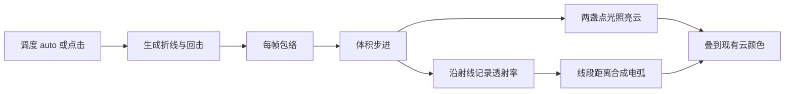
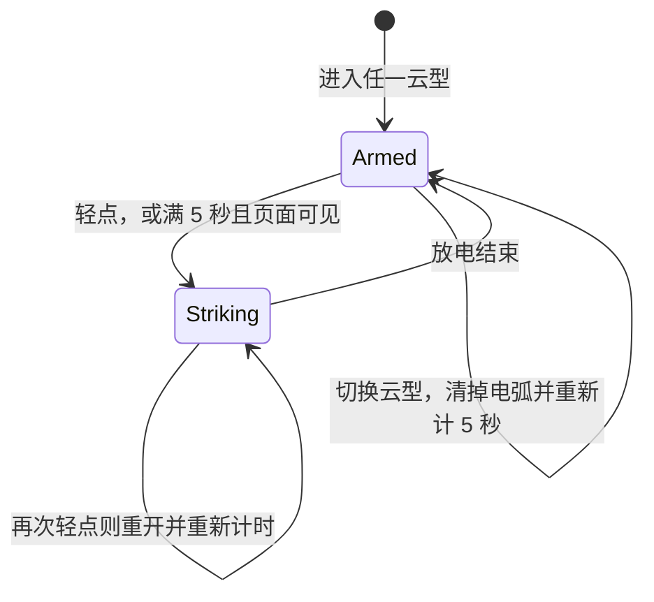

# 积雨云闪电技术设计

调研对象是 [MetalForge Cumulus](https://metalforge.xyz/cumulus) 的实时体积云。本文把其中的打雷效果拆成可在本仓库独立重写的算法，并规定它如何接到现有 WebGL 2 云图鉴上。

本文描述的是观察运行时结构后重新表述的做法，不包含对方着色器源码，也不改现有渲染器。第一版只做视觉闪电。参考实现没有雷声音频。

## 1. 结论

闪电是两层叠加，只在一次放电的几百毫秒内打开：

1. **电弧。** CPU 在放电开始时生成一条向下的折线（主干、分叉、偶尔第二道）。GPU 对每个像素的视线和每条线段求最近距离，画出电芯、辉光和泛光。
2. **云内闪光。** 同一条折线的根部放两盏点光源。体积步进照到云时，沿指向灯的方向做短消光，把云体从内部照亮。

云本身的透射率会压暗藏在云后的电弧，所以闪电看起来长在体积里面，而不是贴在画面上的贴图。

本项目渲染器是每帧全屏单次步进，没有参考实现那种十几次到几十次的渐进累加。因此不必做“闪电路径绕开累加缓冲”。只要在 `flash > 0` 的帧里把电弧和点光算进同一次片元着色即可。

所有云型都可以轻点画面触发放电（指针位移不超过 4 px）。任意一次放电，无论来自点击还是自动，都会把空闲计时重置为 5 秒。满 5 秒仍没有新的放电、当前没有正在进行的放电、且页面可见时，自动放一次。点击正在进行的放电会立刻重开这一次，并重新开始 5 秒计时。切换云型会清掉当前电弧，重新开始 5 秒计时，不会马上自动放电。拖拽旋转不会触发放电。



## 2. 参考效果里实际发生的事

### 2.1 调度

参考页的闪电开关是三态：`auto`、`tap`、`off`。

自动模式的等待时间是：

```
gap = uniform(4.2, 11) * (strikeEvery / 7.6) 秒
```

`strikeEvery` 默认 `7.6`。页面隐藏或画布不可见时只重新排队，不放电。点一下画布或 Strike 按钮会立刻放一次。本项目不沿用这段随机间隔，调度见第 6 节。

一次事件持续大约 `0.5–1.4` 秒，由主闪、若干回击和可选余辉组成，不是单帧白屏。

### 2.2 折线

起点落在该云型自己的盒子里。参考实现里塔状积雨云的盒子大约是：

- `x ∈ [0.35, 0.80]`
- `y ∈ [0.55, 1.35]`
- `z ∈ [-0.45, 0.45]`

然后向下随机游走。方向有惯性，每步再加弯折，并带一个向下的偏置。小概率把弯折放大成钩子。主干大约 30 步，之后再长出最多 3 级分叉。分叉更短、更细、更暗。大约三成概率再生成一条较弱的第二道，步数预算更小。

每一段记录：起点、终点、亮度、半径、是否分叉。段数上限 128。

### 2.3 回击

亮度不是一条指数曲线，而是若干次脉冲相加。

- 主闪：约 8 ms 内拉到满幅，再按 `tau ≈ 0.055–0.09 s` 衰减。分叉在这一下是亮的。
- 回击：约 72% 的概率再跟 1–3 下，间隔 `40–100 ms`，幅度 `0.35–0.9`，`tau ≈ 0.04–0.08 s`。这些下的分叉几乎不亮。
- 余辉：约 45% 的概率在最后再拖一条很暗的尾巴，幅度约 `0.13`，`tau ≈ 0.34 s`。

每帧总亮度再乘 `0.82–1.18` 的随机数，所以电弧会细碎地闪。分叉段的亮度再乘“分叉能量占总能量的比例”，主通道保持全亮。回击因此看起来更干净，只有主干还在跳。

事件时长取最后一击的起始时间，余辉存在时再加 `1 s`，否则加 `0.45 s`。

### 2.4 传给 GPU 的数据

参考实现把段写进一张 `128×2` 的 `RGBA32F` 纹理：

- 第 0 行：起点 `xyz` + 亮度
- 第 1 行：终点 `xyz` + 半径

两盏点光落在主干大约 1/5 和 1/2 处，权重约 `1.0` 和 `0.72`，并略向云心偏一点。

本项目第一版改用 uniform 数组，原因见第 5 节。算法不变。

### 2.5 云内闪光

步进到密度足够的样本时，对每盏灯做两次短步进，累加光学厚度 `τ`，贡献：

```
weight * exp(-τ) / (r² + 0.18)
```

再乘 `flashColor * flash * (9 * flashLight)`。`flashLight` 默认 `1`，所以云内闪光的增益默认是 `9`。

天空或纯色背景另加 `flashColor * flash * 0.035`，整幅画面会轻轻呼吸。这一项很弱，不能替代电弧。

### 2.6 电弧本身

对每个像素的射线和每一段，求射线与线段的最近距离 `d`，以及最近点沿射线的深度。三段响应叠在一起，再对所有线段取 **最大值**。交叉处不会因为相加而爆白。

- 电芯：半径附近的 `smoothstep`，边缘宽度随半径和像素角宽放大
- 辉光：`exp(-(d / radius)² / glowSigma)`
- 泛光：更宽的 `exp(-d² / bloomSigma)`

主步进沿射线记下约 7 个透射率。电弧按命中深度在这些采样之间插值，乘到该段亮度上。云后面的段落变暗，从云缝里穿出的段落保持亮。

写实预设：电芯白，辉光偏冷蓝，主干半径约 `0.0105`。动漫预设更粗、更弯，并带几段很短的碎屑，辉光更蓝。第一版只做写实。

## 3. 本项目现状

渲染器在 [`dist/cloud-altas/cloud-renderer.js`](../dist/cloud-altas/cloud-renderer.js)。入口页在 [`dist/cloud-altas/index.html`](../dist/cloud-altas/index.html)。没有第三方运行时。

和闪电相关的现状：

- 片元着色器每帧做 56 步体积步进。离包络较远的空步会按距离加大。密度来自 `cloudEnvelope` 加 3D Perlin–Worley；细噪声只加在包络表面附近。
- 光照是一盏方向光：4 步不等距向光采样、Beer–Lambert、三叶相位、粉末项。没有点光源。
- 输出是预乘 alpha。云的不透明度低于 `0.006` 时直接返回透明，后面的照片背景透出来。
- 积雨云包络是一串平滑并集的球，加上底座椭球和砧状椭球。砧仍在 `y ≈ 2.02`。层积云和积云同样用球团平滑并集。卷云、高积云、高层云、雨层云仍是原来的包络。

- 相机在 `z ≈ 5.65 * zoom`，绕原点轨道。`zoom` 默认 `0.90`。
- 页面状态在 `index.html` 的 `state` 里：当前云型、云量、日光、yaw、pitch、zoom。画布上的拖拽和滚轮已经占用指针。

积雨云文案已经写了“可能伴随雷电”。

## 4. 接到现有步进上

改动集中在 `cloud-renderer.js`。`index.html` 在任意云型上把轻点写成 `state.strikeRequested`。不引入新依赖，不改噪声贴图。层积云、积云、积雨云的包络是球团平滑并集；其余云型仍用各自原来的包络。

### 4.1 生成盒子

参考实现的盒子是它自己的 SDF 云尺度。本项目的积雨云更高，砧在 `y ≈ 2.02`。起点放在塔柱内部、偏背向相机的一侧（`+z` 朝向相机），游走方向主要是 `-Y`，并略微朝 `+z` 走，让通道从云核走向云的前下方：

- `x ∈ [-0.16, 0.20]`
- `y ∈ [0.85, 1.55]`
- `z ∈ [-0.46, -0.14]`
- 每步长度约 `0.18`，再乘 `uniform(0.7, 1.3)`

这样主干从塔身内部走到云底再伸出。切换云型、重置视角时丢弃当前折线。

### 4.2 不能提前返回

现有片元在不透明度不足时直接写出透明并返回。电弧和全屏微闪必须在这次返回之前算完。

没有云的像素也要能画出伸出云体的电弧。背景是 `cloud-atlas-bg.png`，画布是透明的。闪光和电弧用预乘加色写进 `fragColor`，不要去改照片像素：

```
rgb = cloudRgb + bolt * transmittanceInFront + veil
a   = min(1, cloudAlpha + boltCover)
```

画布开启了预乘 alpha。电弧从云核里向下、略朝相机走，不从朝向相机的那一面起跳。屏幕空间的亮芯乘上该深度之前的云透射率：云体前方会把它压暗，薄的地方和伸出云底的部分仍然发亮。不从已经画好的云颜色里抠缝，所以云的受光还留在通道上。两盏点光落在主干约 1/5 和 1/2 处，把周围云体从内部照亮。`veil` 只在电弧附近很淡地加。没有放电时两者都是 0。

### 4.3 点光插入位置

点光加在现有光照求和之后、`sampleAlpha` 累加之前。只在 `flash > 0.001` 时，对两盏灯各调用两次 `densityAt`。不要把 4 步太阳采样改成每盏灯都做满。

### 4.4 透射率采样

主循环已经有 `transmittance`。靠近包络时按约 `0.16` 的间距记下最多 24 个透射率。电弧段的命中深度落在这些采样之间时，用插值得到的透射率压暗该段；命中还在云体积之前时透射率为 1。

### 4.5 Uniform

每帧新增：

| Uniform | 类型 | 含义 |
| --- | --- | --- |
| `flash` | float | 当前帧总亮度，无放电时为 0 |
| `flashColor` | vec3 | 线性闪光色，默认 `(0.74, 0.80, 1.0)`，显示为 `#DEE6FF` |
| `segCount` | int | 有效段数，0 到上限 |
| `light0`、`light1` | vec4 | `xyz` 位置，`w` 权重 |
| `segA[N]` | vec4 | 起点 `xyz` + 亮度 |
| `segB[N]` | vec4 | 终点 `xyz` + 半径 |

`N` 桌面为 64，视口宽度小于 700 px 时为 32。用 uniform 而不是浮点纹理，避免依赖浮点纹理扩展。`flash <= 0.001` 或 `segCount == 0` 时电弧循环直接跳过。

段数据在一次放电开始时生成，帧间只改亮度通道（分叉乘当前分叉门控）。几何不要每帧重生成，否则电弧会乱跳而不是闪烁。

## 5. 算法

符号都在云的模型空间里，和 `densityAt` 的 `p` 一致。射线已经经过页面里的 yaw / pitch 旋转。

### 5.1 写实折线

默认几何常数（对应参考实现的写实电弧，长度已换到本项目盒子）：

| 名称 | 值 | 作用 |
| --- | --- | --- |
| `radius` | `[0.0105, 0.0062, 0.0038, 0.0024]` | 主干到第 3 级分叉的半径 |
| `brightness` | `[1, 0.58, 0.34, 0.20]` | 各级相对亮度 |
| `steps` | `[30, 6, 3, 2]` | 各级步数，再乘分叉倍率 |
| `length` | `[0.20, 0.15, 0.11, 0.08]` | 各级步长 |
| `count` | `[7, 8, 6]` | 第 1 到第 3 级分叉条数 |
| `maxLevel` | `3` | 分叉深度 |
| `kink` | `0.42` | 每步横向弯折 |
| `hardP` | `0.16` | 大弯钩概率 |
| `hook` | `2.4` | 弯钩把 `kink` 放大的倍数 |
| `persist` | `0.72` | 方向惯性 |
| `fall` | `0.30` | 每步额外向下的量 |
| `splitP` | `0.60` | 主干中段再分出一支的概率 |

用户旋钮只缩放这些常数：

- `branches` 默认 `1`，乘到 `count`
- `thickness` 默认 `1`，乘到 `radius`
- `crooked` 默认 `1`，乘到 `kink`

生成过程：

1. 在云核盒子里取起点 `p0`，`z` 取背向相机的一侧。初始方向以向下为主，并略朝相机（`+z`）偏，让通道从云里走向前下方。
2. 走主干。每步方向为 `persist * 上一步 + 弯折`。若随机数小于 `hardP`，弯折乘 `hook`。`y` 分量再减去 `fall`，并限制不要朝上走。步长乘 `uniform(0.7, 1.3)`。亮度沿主干从 1 缓降到约 `0.92`。
3. 若主干节点多于 6 个且随机数小于 `splitP`，从中段一个节点再长出一支较短的主干，亮度约 `0.82`。
4. 对每一级，从上一级节点里不放回地抽 `count[level]` 个，向侧面长出下一级。子段亮度乘该级 `brightness`。
5. 以约 30% 概率用更小的步数预算再生成第二条更暗的通道，幅度约 `0.55–0.75`。
6. 截断到 `N`。记录主干起点，供点光使用。

点光：

```
light0 = (0.45 * origin + (0, 0.05, 0), weight 1.00)
light1 = (origin,                     weight 0.75)
```

`origin` 是第一条主干的起点。

### 5.2 回击包络

一次放电开始时生成脉冲列表 `strokes`。每个脉冲有起始时间 `t0`、幅度 `A`、时间常数 `tau`、分叉权重 `branched`。

```
strokes = [
  { t0: 0, A: 1, tau: uniform(0.055, 0.09), branched: 1 }
]
```

以 72% 概率追加 `round(uniform(1, 3))` 个回击。第 `k` 个的 `t0` 在前一个基础上加 `uniform(0.04, 0.10)`，`A = uniform(0.35, 0.9)`，`tau = uniform(0.04, 0.08)`，`branched = 0.16`。

以 45% 概率再追加余辉：`t0` 比上一击晚 `0.02 s`，`A = 0.13`，`tau = 0.34`，`branched = 0.10`。

```
duration = last.t0 + (有余辉 ? 1.0 : 0.45)
```

在放电时间 `t`（秒）上：

```
pulse(dt, A, tau) = A * min(1, dt / 0.008) * exp(-dt / tau)

energy  = Σ pulse(t - t0)           仅 t >= t0
branchE = max( pulse * branched )    仅 t >= t0

flash       = energy * uniform(0.82, 1.18)
branchGate  = max(branchE / energy, 0.12)   energy > 0
```

上传时，分叉段的亮度乘 `branchGate`，主干段不乘。`t > duration` 后把 `flash` 和 `segCount` 清零，并预约下一次。

`uniform(0.82, 1.18)` 每帧重抽。几何不变。

### 5.3 射线与线段的距离

射线 `ro + rd * t`，`rd` 为单位向量。线段端点 `a → b`，半径 `radius`，亮度 `bri`。

```
ba  = b - a
w0  = ro - a
Bc  = dot(rd, ba)
Cc  = dot(ba, ba)
D   = dot(rd, w0)
E   = dot(ba, w0)
den = Cc - Bc * Bc

s   = den > 1e-6 ? clamp((E - Bc * D) / den, 0, 1) : 0
tRay = max(Bc * s - D, 0)
d    = length(w0 + rd * tRay - ba * s)
```

`s` 限制在线段上，`tRay` 限制在射线前方。

像素角宽：

```
pixelWidth = tRay * 2 * tanHalfFov / resolution.y
edge       = max(radius * 0.30, pixelWidth * 0.85)
```

本项目垂直视场可由现有射线构造反推：屏幕 `y = 1` 时方向 `z` 分量为 `-1.74`，半高对应的 `tan` 约为 `1 / 1.74`。实现时直接用当前 `rayDirection` 与分辨率，不必另加投影矩阵。

写实三段：

```
core  = (1 - smoothstep(radius - edge, radius + edge, d)) * bri
glow  = exp(-(d / radius)² / 15) * bri
bloom = exp(-(d * d) / 0.04) * bri

coreM  = max(coreM, core)
glowM  = max(glowM, glow)
bloomM = max(bloomM, bloom)
```

颜色与增益：

```
coreColor  = (1.00, 1.00, 1.00)
glowColor  = (0.70, 0.82, 1.00)
bloomColor = (0.56, 0.60, 1.00)

bolt = (coreColor * 11 * coreM
      + glowColor * 1.7 * glowM
      + bloomColor * 0.22 * bloomM) * flash
```

`glowSigma = 15`，`bloomSigma = 0.04`，`edgeW = 0.30`，`coreAmp = 11`，`glowAmp = 1.7`，`bloomAmp = 0.22`。

### 5.4 透射率遮挡

主循环在包络附近按约 `0.16` 的间距记下最多 24 个 `transmittance`。电弧段的 `tRay` 落在相邻两个采样之间时：

```
depth = clamp((tRay - travel[k]) / (travel[k + 1] - travel[k]), 0, 1)
occ   = mix(Tz[k], Tz[k + 1], depth)
```

`tRay` 在第一个采样之前时 `occ = 1`。该段亮度在算 `core/glow/bloom` 之前乘 `pow(occ, 0.85)`。

现有步进的 `transmittance` 是标量。这些采样够表达“穿过厚云变暗”。不要为遮挡再跑一遍 56 步。

### 5.5 点光消光

对密度大于 `0.008` 的样本 `p`，两盏灯各做：

```
r  = length(light.xyz - p)
ld = (light.xyz - p) / r
τ  = 0
s  = 0
for j in 1..2:
  s += 0.18 * j
  τ += densityAt(p + ld * min(s, r)) * (0.18 * j)

lit += light.w * exp(-τ * sigma) / (r * r + 0.18)
```

`sigma` 沿用该样本已经用于吸收的密度系数，也就是现有 `1.0 - exp(-density * baseStep * 2.04)` 所对应的密度本身，消光时用 `density * 2.04` 作为 `sigma` 的数量级，和当前云的厚薄一致。不要另造一套和 `densityAt` 无关的光学厚度。

云颜色追加：

```
lighting += flashColor * flash * (9 * flashLight) * lit
```

`flashLight` 默认 `1`。参考写实闪光的线性颜色是 `(0.74, 0.80, 1.0)`，按 `pow(c, 1/2.2)` 显示为 `#DEE6FF`。着色器里直接使用线性值。页面若只保存 sRGB 十六进制，上传前做一次 `pow(c, 2.2)`，不要对已经是线性的值再做一次。

太阳光、相位和粉末项保持原样。点光不再乘相位函数，它是近处的体光源。

## 6. 状态机

每一种云都同时接受轻点和 5 秒空闲自动放电。空闲截止时间是「上一次放电开始 + 5000 ms」。切换云型时立刻清零 `flash` 和 `segCount`，并把截止时间重排到切换后的 5 秒，不立刻放电。



右上角提示固定为 “Click to strike”。在画布上松开指针且位移不超过 4 px 时触发放电。拖拽轨道已经占用 `pointerdown`，超过 4 px 的手势只旋转视角。不额外放按钮。

页面 `document.hidden` 时不自动放电。重新可见后，如果截止时间已经过去，下一帧放一次。点击不受隐藏状态限制；只要指针事件送到页面，就重开一次并重新计 5 秒。

一次放电进行中不会叠两条折线。轻点会丢掉当前折线，立刻生成下一次。自动放电只在当前没有折线时发生，所以 5 秒到点时如果上一次还没结束，会等到它结束的下一帧再放。

## 7. 默认参数

第一版写死写实预设，只暴露下面这些，且都可以先不做 UI，用常数即可：

| 参数 | 默认 | 范围 | 说明 |
| --- | --- | --- | --- |
| `lightning` | 全部云型 | 轻点，外加 5 秒空闲自动一次 | 见第 6 节 |
| 空闲自动 | `5` s | 固定 | 距上次放电开始满 5 秒且当前无电弧时放一次 |
| `branches` | `1` | `0–2` | 分叉条数倍率 |
| `thickness` | `1` | `0.3–4` | 半径倍率 |
| `crooked` | `1` | `0–2.5` | 弯折倍率 |
| `flashLight` | `1` | `0–3` | 云内闪光，着色器再乘 9 |
| `flashColor` | `#DEE6FF` | 颜色 | 线性 `(0.74, 0.80, 1.0)` 的 sRGB 显示值 |

不进第一版：

- 动漫电弧、碎屑、色带色调
- 雷声、环境音
- 用户手绘云上的闪电
- 按云型关闭闪电

## 8. 性能

放电之外，`segCount = 0`，片元循环不跑，点光不做额外 `densityAt`。其他云型的开销应与现在相同。

放电期间，每个像素最多：

- 64 次射线–线段距离（窄屏 32 次）
- 每个有云样本额外 4 次 `densityAt`（两盏灯 × 2 步）

电弧循环比体积步进便宜，因为它不采样 3D 纹理。风险在点光的额外密度采样，而且只发生在本来就要算云的样本上，持续时间不到 1.5 秒。

若窄屏帧时间明显变长，先把段数降到 32，不要先砍 56 步主步进。主步进决定云的形状，砍步数会让积雨云在闪电时变糊。

## 9. 验收

用本地静态页打开云图鉴，选中积雨云。

- 数秒后出现向下的弯折电弧，不是直片，也不是全屏白闪。
- 电弧从云砧或塔柱附近出发，穿过塔身。密的部分把后面的段落压暗，伸出云的部分仍亮。
- 云体内部在主闪时被冷白光照亮，随后按回击跳几下，再暗下去。
- 同一次事件里能看出至少一次较暗的后续闪动。分叉在后续闪动里明显更弱。
- 拖拽旋转和滚轮缩放仍然可用。放电过程中旋转，电弧留在云的模型空间里，跟着云转。
- 任意云型轻点都会出现电弧；拖拽旋转不会打。积雨云同样可以点，不必等自动放电。
- 一次放电开始后再过大约 5 秒，如果期间没有点击、页面仍可见、且上一次已经结束，会自动再放一次。
- 切走任意正在放电的云型时，闪光立刻消失，并且不会在切换的同一帧自动再打。新的自动放电从切换后再数 5 秒。
- 浏览器控制台没有着色器编译错误。WebGL 2 不可用时仍走现有的警告条，不抛未捕获异常。

桌面宽度和约 390 px 宽的视口都看一次。窄视口只检查段数降低后电弧仍然连续，而不是变成一团光斑。

## 10. 实现顺序

1. 在渲染器里加折线生成和回击包络，先用常量把段画成不遮挡的电弧，确认形状。
2. 加上 6 点透射率遮挡，确认电弧能埋进云里。
3. 加上两盏点光，确认云体被从内部照亮，且其他云型不变。
4. 接上轻点触发，以及 5 秒空闲自动放电。
5. 按第 9 节在浏览器里走一遍积雨云和相邻云型。
